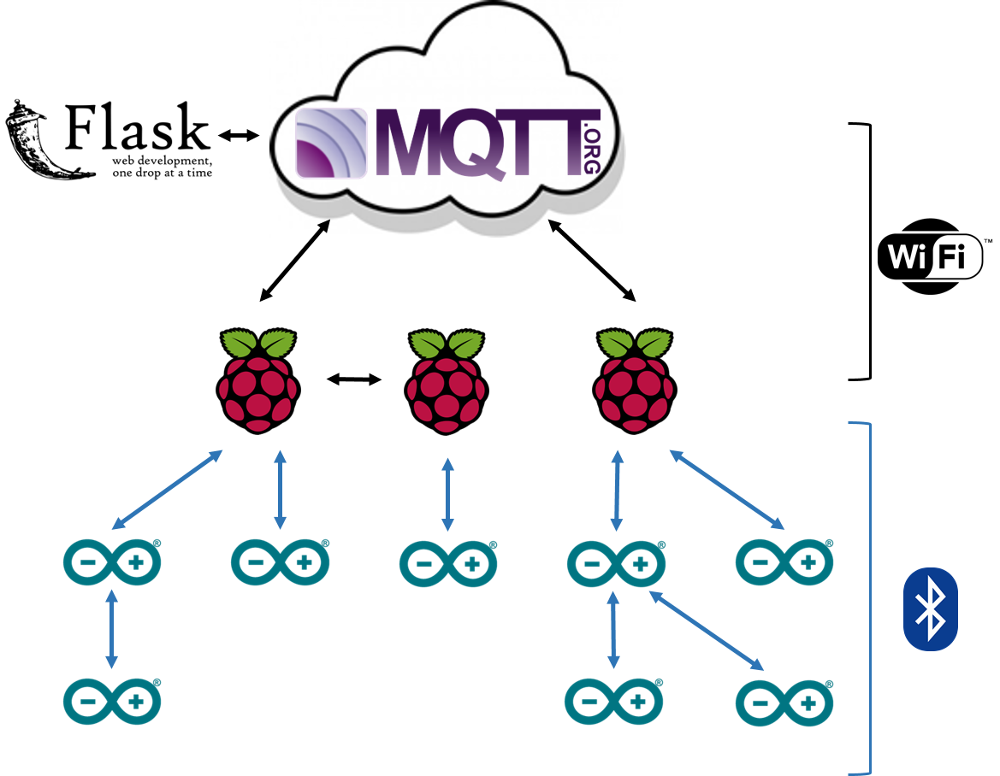

## Current IoThingies architecture




## Topics
```
broker-services/discover          (json dict of connected smart agents
                                   mapping to a list of their edge devices)
               /request           (request repost status)
PI1/public/arduino1/input/sensor1 (eg for LED write 1/0 to toggle on/off)
                         /sensor2
                         ...
                   /output/sensor3 (eg write analogue read values here)
                          /sensor4
                           ...
          /arduino2/...
          /arduino3/...
          ...
   /private/log/...
           /error/...
           /status                 (Is smart agent connected?)
           /edge                   (json list of edge devices (arduinos) for
                                    this PI)
PI2/public/...
   /private/...
PI3/...
PI4/...
...
```

### Setup / Explanation

#### Status
All smart agents should publish retained messages on `agentID/private/status`
with:
- `"C" + str(time.time())` just after connecting
- `"DG"` just before disconnecting gracefully
- `"DU"` as their last will

For the moment, `time.time()` is not used. It could be used in the future to clean up devices that haven't contacted in a while. It may as well be implemented now for the future. Note that this seems to be common across SCD Cloud + RPI (I assume the Internet is used to sync this).

It might be nice to import [provider.py](Cloud/broker_services/provider.py)'s `STATUS_CONNECTED`, `STATUS_DISCONNECTED_GRACE`, `STATUS_DISCONNECTED_UNGRACE`,  rather than hardcode `"C", "DG", "DU"` respectively.


There are now two ways to get the currently connected smart agents:

1. Subscribing to `+/private/status`, anyone can get the current status of any/all devices (provided retained messages are used). [provider.py](Cloud/broker_services/provider.py)'s `updateSmartAgentsOrEdgeDevices()` could be imported by a smart agent and called in the callback to receiving a message here or on `agentID/private/edge` to update a local dictionary of connected smart agents to their edge devices.
2. `broker-services/discover` is updated by the python script [provider.py](Cloud/broker_services/provider.py). Containing a json encoded dictionary of the currently connected smart agents to a list of their edge devices. It posts a retained message here so a newly connected smart agent can immediately get information as soon as they subscribe.

#### Edge

All smart agents should publish retained messages on `agentID/private/edge` with a json encoded list of the smart agents connected to it (publish every time this changes).
